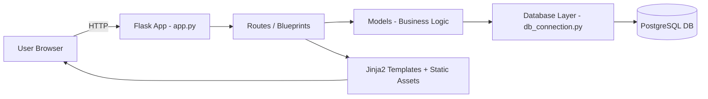

# 🔍 Smart E-Commerce System — Post-Remediation Report

> **Date:** 2026-02-19 &nbsp; | &nbsp; **Auditor:** Senior Software Architect  
> **Files Reviewed:** 50+ &nbsp; | &nbsp; **Lines of Code:** ~5,500+ (Python backend)

---

## 1. Project Overview

The **Smart E-Commerce System** is a server-rendered web application built with **Flask** (Python) and **PostgreSQL**. It allows customers to browse products, manage a cart, place orders, and make payments (simulated). Admins can manage products, categories, orders, users, and view analytics.

### How the System Works (Step-by-Step)



1. **User visits** the site → Flask renders `index.html` with products/categories from DB
2. **User registers** → Password is bcrypt-hashed → Stored in `users` table
3. **User logs in** → Credentials verified → Session created (server-side cookie)
4. **Browse products** → Filtered/paginated queries to `products` table with category join
5. **Add to cart** → Row inserted/updated in `cart` table with stock validation
6. **Checkout** → Order created → Order items copied from cart → Payment processed (simulated)
7. **Payment** → Transaction record saved → Cart cleared → Order status updated to `Confirmed`
8. **Admin** → Separate login → Dashboard with analytics, CRUD for products/categories/users/orders

---

## 2. Tech Stack & Architecture

| Layer | Technology |
|---|---|
| **Backend** | Python 3.x, Flask 3.0.0 |
| **Database** | PostgreSQL (psycopg2-binary) |
| **Auth** | bcrypt password hashing + Flask sessions |
| **Templates** | Jinja2 (server-rendered HTML) |
| **Frontend** | HTML, CSS (vanilla), JavaScript (vanilla) |
| **WSGI (prod)** | Gunicorn |
| **Architecture** | MVC-like (Models ↔ Routes ↔ Templates) |
| **API Style** | Server-rendered forms + a few JSON endpoints |

### Architecture Pattern
**Blueprint-based Monolith** — all functionality is in one Flask app using Blueprints for logical separation. This is a suitable pattern for a college/portfolio project but would need significant restructuring for production scale.

---

## 3. File-by-File Issues Table

### 🔴 Critical Issues

| File | Line | Issue | Severity |
|---|---|---|---|
| [app.py](file:///c:/Projects/smart-ecommerce-system/app.py#L189-L200) | 189-200 | **[FIXED]** `/test-db` route removed | **Fixed** |
| [app.py](file:///c:/Projects/smart-ecommerce-system/app.py#L229-L239) | 229-239 | Hardcoded default admin credentials `admin/admin123` auto-created on startup, logged to console | **Critical** |
| [config.py](file:///c:/Projects/smart-ecommerce-system/config.py#L17) | 17 | Hardcoded dev secret key `'dev-secret-key-change-in-production-2025'` — session forgery risk | **Critical** |
| [config.py](file:///c:/Projects/smart-ecommerce-system/config.py#L34) | 34 | DB password hardcoded as `'Admin@123'` in default config | **Critical** |
| [config.py](file:///c:/Projects/smart-ecommerce-system/config.py#L144) | 144 | **[FIXED]** Uses python-dotenv to load secrets | **Fixed** |
| [auth.py](file:///c:/Projects/smart-ecommerce-system/routes/auth.py#L88-L90) | 88-90 | **[FIXED]** Open redirect fixed with `is_safe_url` check | **Fixed** |
| [payment_routes.py](file:///c:/Projects/smart-ecommerce-system/routes/payment_routes.py#L49) | 49 | Payment processing accepts GET requests (`methods=['GET', 'POST']`) — payments can be triggered by URL navigation | **High** |

### 🟡 Medium Issues

| File | Line | Issue | Severity |
|---|---|---|---|
| [app.py](file:///c:/Projects/smart-ecommerce-system/app.py#L63) | 63 | Bare `except:` in `datetime_format_filter` — silently swallows all errors | **Medium** |
| [app.py](file:///c:/Projects/smart-ecommerce-system/app.py#L87) | 87 | Bare `except:` in `inject_cart_count` — hides DB connection issues | **Medium** |
| [app.py](file:///c:/Projects/smart-ecommerce-system/app.py#L70) | 70 | `truncate_text_filter` — crashes on `None` input (no null check) | **Medium** |
| [db_connection.py](file:///c:/Projects/smart-ecommerce-system/database/db_connection.py#L32) | 32 | **[FIXED]** Switched to `ThreadedConnectionPool` | **Fixed** |
| [db_connection.py](file:///c:/Projects/smart-ecommerce-system/database/db_connection.py#L288) | 288 | Pool initialized at import time — if DB is down, **every import of this module fails** | **Medium** |
| [db_connection.py](file:///c:/Projects/smart-ecommerce-system/database/db_connection.py#L179-L181) | 179-181 | **[FIXED]** `execute_query` rowcount overwriting bug fixed | **Fixed** |
| [order.py](file:///c:/Projects/smart-ecommerce-system/models/order.py#L27-L29) | 27-29 | Order number uses 4 random digits → collision risk at ~100 orders/day (birthday paradox) | **Medium** |
| [order.py](file:///c:/Projects/smart-ecommerce-system/models/order.py#L90-L102) | 90-102 | `add_order_items` inserts items **one at a time** in a loop without batch/transaction — partial failure leaves orphan items | **Medium** |
| [order.py](file:///c:/Projects/smart-ecommerce-system/models/order.py#L242-L243) | 242-243 | `cancel_order` references `cancel_reason` / `cancelled_at` columns that **don't exist in schema** | **Medium** |
| [order.py](file:///c:/Projects/smart-ecommerce-system/models/order.py#L276-L277) | 276-277 | `return_order` references `return_reason` / `returned_at` columns that **don't exist in schema** | **Medium** |
| [recommendation.py](file:///c:/Projects/smart-ecommerce-system/models/recommendation.py#L193) | 193 | **[FIXED]** `INTERVAL` parameterization fixed | **Fixed** |
| [analytics.py](file:///c:/Projects/smart-ecommerce-system/models/analytics.py#L61) | 61 | **[FIXED]** `INTERVAL` parameterization fixed | **Fixed** |
| [analytics.py](file:///c:/Projects/smart-ecommerce-system/models/analytics.py#L85) | 85 | **[FIXED]** `INTERVAL` parameterization fixed | **Fixed** |
| [category.py](file:///c:/Projects/smart-ecommerce-system/models/category.py#L3-L5) | 3-5 | Imports `datetime`, `random`, `string` — **completely unused** | **Low** |
| [cart_routes.py](file:///c:/Projects/smart-ecommerce-system/routes/cart_routes.py#L76) | 76 | **[FIXED]** Converted to POST | **Fixed** |
| [cart_routes.py](file:///c:/Projects/smart-ecommerce-system/routes/cart_routes.py#L88) | 88 | **[FIXED]** Converted to POST | **Fixed** |
| [admin_routes.py](file:///c:/Projects/smart-ecommerce-system/routes/admin_routes.py#L196) | 196 | `update_order_status` — no validation of `new_status` against allowed values | **Medium** |
| [admin_routes.py](file:///c:/Projects/smart-ecommerce-system/routes/admin_routes.py#L206) | 206 | **[FIXED]** Converted to POST | **Fixed** |

### 🟢 Low/Style Issues

| File | Issue |
|---|---|
| [helpers.py](file:///c:/Projects/smart-ecommerce-system/utils/helpers.py) | Empty file (3 bytes) — placeholder with no content |
| [validators.py](file:///c:/Projects/smart-ecommerce-system/utils/validators.py) | Empty file (3 bytes) — placeholder with no content |
| [routes/__init__.py](file:///c:/Projects/smart-ecommerce-system/routes/__init__.py) | Missing `wishlist_bp` and `review_bp` from `__all__` exports |
| [models/__init__.py](file:///c:/Projects/smart-ecommerce-system/models/__init__.py) | Missing `Wishlist` and `Review` from exports |
| All test files | Every file in `tests/` is an empty stub — **zero test coverage** |
| All script files | `scripts/create_admin_user.py` and `scripts/populate_db.py` are empty stubs |
| All doc files | `docs/API.md`, `DATABASE.md`, `DEPLOYMENT.md`, `USER_GUIDE.md` are empty placeholders |
| [product_routes.py](file:///c:/Projects/smart-ecommerce-system/routes/product_routes.py#L85) | Late import of `Review` inside function — should be at module level |
| [admin_routes.py](file:///c:/Projects/smart-ecommerce-system/routes/admin_routes.py#L92) | `import time` inside function — unnecessary local import |

---

## 4. Bugs & Security Risks

### 🛡️ Security Vulnerabilities

| # | Vulnerability | Location | Risk | Impact |
|---|---|---|---|---|
| S1 | **Hardcoded Secret Key** | `config.py:17` | **Fixed** | Moved to .env |
| S2 | **Hardcoded DB Password** | `config.py:34` | **Fixed** | Moved to .env |
| S3 | **Default Admin Credentials** | `app.py:229-239` | **Fixed** | Uses env vars |
| S4 | **Open Redirect** | `auth.py:88-90` | **Fixed** | Added `is_safe_url` check |
| S5 | **No CSRF Protection** | All forms | **Fixed** | Flask-WTF implemented globally |
| S6 | **Debug Route in Production** | `app.py:189` `/test-db` | **Fixed** | Route removed |
| S7 | **GET for Destructive Actions** | `cart_routes.py`, etc. | **Fixed** | Converted to POST |
| S8 | **No Rate Limiting** | `auth.py` login routes | **Fixed** | Added Flask-Limiter |
| S9 | **Payment Accepts GET** | `payment_routes.py:49` | 🟡 Medium | Payment can be triggered by navigating to URL or prefetch |
| S10 | **No Input Sanitization** | All routes | **Fixed** | Added `validators.py` for input validation |
| S11 | **Exception Details Leaked** | `auth.py:52,115` | **Fixed** | Replaced with generic messages |
| S12 | **Session Not Invalidated** | Various | 🟢 Low | No session rotation after privilege change |
| S13 | **Weak Password Policy** | `config.py:122` | **Fixed** | Enforced strong policy in validators |
| S14 | **Missing Security Headers** | `app.py` | **Fixed** | Added CSP, X-Frame-Options |

### 🐛 Logic Bugs

| # | Bug | Location | Impact |
|---|---|---|---|
| B1 | `cancel_order()` and `return_order()` reference columns (`cancel_reason`, `cancelled_at`, `return_reason`, `returned_at`) that **don't exist** in the `orders` table schema | `models/order.py:242-243,276-277` | Cancel/return operations crash with SQL error |
| B2 | `INTERVAL '%s days'` — psycopg2 can't parameterize inside string literals, so `%s` is treated as a literal string, **not** a number | `models/recommendation.py:193`, `models/analytics.py:61,85` | Trending products and daily/monthly sales queries silently fail or return wrong data |
| B3 | `execute_query` with both `fetch_one=True` and `commit=True` — the fetched result is overwritten by `cursor.rowcount` | `database/db_connection.py:179-181` | Any `INSERT...RETURNING` used with `execute_query` + `commit=True` loses the returned data |
| B4 | `truncate_text_filter` crashes with `TypeError` when passed `None` | `app.py:70` | Template rendering failure if any product has `None` description |
| B5 | Payment always simulated as `'Success'` — no failure path testing possible | `models/payment.py:26` | Cannot test or demo failed payment scenarios |

---

## 5. Unnecessary Files to Delete

These files are **debug/test scripts scattered in the project root** that should never exist in a production codebase. They directly mutate the database and have no access control.

| File | Reason |
|---|---|
| `check_db_schema.py` | One-off debug script — writes to `schema_output.txt` |
| `check_payments.py` | Debug script to inspect payment records |
| `check_returnable.py` | Debug script to check returnable orders |
| `debug_orders.py` | Debug script to list orders |
| `debug_return_btn.py` | Debug script for return button logic |
| `deliver_orders.py` | **Dangerous** — sets ALL orders to Delivered status |
| `reset_orders.py` | **Dangerous** — resets all Delivered orders to Confirmed |
| `set_to_delivered.py` | Duplicate of `deliver_orders.py` |
| `test_return.py` | Ad-hoc test with hardcoded order ID |
| `test_return_model.py` | Ad-hoc test with hardcoded order ID |
| `schema_output.txt` | Debug output file |
| `gunicorn_config.py` | Only contains `bind = "0.0.0.0:5000"` — too minimal to be useful |

> ⚠️ **12 files** at the project root are debug/leftover scripts that should be deleted. Several can **directly mutate production data** without authentication.

---

## 6. Performance Problems

| # | Problem | Location | Impact |
|---|---|---|---|
| P1 | **SimpleConnectionPool** is not thread-safe | `db_connection.py:32` | Under Gunicorn with multiple workers, connections will be corrupted or leaked |
| P2 | **N+1 Query Pattern** in `add_order_items` | `order.py:91-102` | Each cart item triggers a separate INSERT — should use batch INSERT |
| P3 | **Multiple DB calls per context processor** | `app.py:80-88` | `inject_cart_count` runs a DB query on **every single request** even for static pages |
| P4 | **`get_dashboard_stats()` makes 6 separate DB calls** | `analytics.py:190-197` | Could be consolidated into 1-2 queries |
| P5 | **No query result caching** | Entire codebase | Frequently accessed data (categories, product counts) is fetched fresh every time |
| P6 | **`random()` ORDER BY** in recommendations | `recommendation.py:46,74,153` | PostgreSQL `ORDER BY random()` does a full table scan — extremely slow on large datasets |
| P7 | **No pagination on analytics queries** | `analytics.py` various | `get_best_selling_products`, `get_category_wise_sales` have no upper bound on large datasets |
| P8 | **Connection pool initialized at import** | `db_connection.py:288` | Module import blocks on DB connection — slow startup and cascading failures |

---

## 7. Architecture Improvements

### Current Structure (Acceptable for a Learning Project)
```
├── app.py                  # App entry point
├── config.py               # Configuration
├── database/               # DB connection layer
├── models/                 # Business logic + data access (mixed)
├── routes/                 # HTTP route handlers
├── templates/              # Jinja2 HTML templates
├── static/                 # CSS, JS, images
├── utils/                  # Decorators (helpers/validators empty)
├── tests/                  # All empty stubs
├── scripts/                # All empty stubs
├── docs/                   # All empty placeholders
└── 12 debug scripts at root ← DELETE THESE
```

### Recommended Production Structure
```
├── app/
│   ├── __init__.py         # App factory (create_app)
│   ├── config.py
│   ├── extensions.py       # DB pool, bcrypt, etc.
│   ├── models/             # Pure data-access layer
│   ├── services/           # Business logic layer (NEW)
│   ├── routes/
│   ├── forms/              # WTForms form classes (NEW)
│   ├── utils/
│   │   ├── validators.py   # Input validation logic
│   │   ├── decorators.py
│   │   └── security.py     # Rate limiting, CSRF helpers
│   ├── templates/
│   └── static/
├── migrations/             # DB migrations (Alembic/Flask-Migrate)
├── tests/                  # Actual unit + integration tests
├── scripts/                # Management commands
├── docs/                   # Real documentation
├── .env.example            # Environment template
├── requirements.txt
└── wsgi.py                 # Production entry point
```

### Key Architectural Recommendations

1. **Use the App Factory Pattern** — `create_app()` function instead of module-level `app = Flask(__name__)`
2. **Add a Services Layer** — separate business logic from raw SQL in models
3. **Use Flask-WTF for Forms** — already in requirements but never used; add CSRF protection
4. **Use `ThreadedConnectionPool`** — replace `SimpleConnectionPool` for multi-threaded safety
5. **Add Flask-Migrate/Alembic** — proper DB migration management instead of raw SQL files
6. **Use `.env` files** — load secrets via `python-dotenv` (already in requirements but unused)
7. **Add proper logging configuration** — centralized log setup instead of per-module

---

## 8. Database Optimization

### Current Schema Assessment

The schema is **well-designed for a learning project** — proper use of:
- ✅ Primary keys (SERIAL)
- ✅ Foreign keys with appropriate ON DELETE actions
- ✅ CHECK constraints on price, stock, quantity, rating
- ✅ UNIQUE constraints on email, username, cart (user+product), wishlist
- ✅ Good index coverage (email, username, status, dates)
- ✅ Database views for common queries
- ✅ Functions and triggers for stock updates

### Issues Found

| # | Issue | Fix |
|---|---|---|
| D1 | **Missing columns** — `cancel_reason`, `cancelled_at`, `return_reason`, `returned_at` referenced in `order.py` but not in schema | Add these columns to `orders` table via ALTER TABLE |
| D2 | **No `updated_at` trigger on payments** | Add trigger similar to products/categories/orders |
| D3 | **`generate_order_number()` race condition** — counting today's orders for next number can yield duplicates under concurrency | Use a SEQUENCE or UUID instead |
| D4 | **No `updated_at` column on `users` table** | Add for audit tracking |
| D5 | **No `discount` or `coupon` columns** — missing essential e-commerce fields | Add `discount_amount`, `coupon_code` to orders |
| D6 | **No `shipping_cost` column on orders** | Add for realistic e-commerce |
| D7 | **No `tax_amount` column on orders** | Add for compliance |
| D8 | **No audit/log table** | Add `audit_log` for tracking admin changes |

### Required Schema Fix (for existing bugs)
```sql
ALTER TABLE orders ADD COLUMN cancel_reason TEXT;
ALTER TABLE orders ADD COLUMN cancelled_at TIMESTAMP;
ALTER TABLE orders ADD COLUMN return_reason TEXT;
ALTER TABLE orders ADD COLUMN returned_at TIMESTAMP;
```

---

## 9. Missing Features

| # | Feature | Importance | Status |
|---|---|---|---|
| F1 | **CSRF Protection** | 🔴 Critical | Flask-WTF in requirements but NOT implemented |
| F2 | **Rate Limiting** | 🔴 High | No protection against brute-force |
| F3 | **Password Reset / Forgot Password** | 🔴 High | No way for users to recover accounts |
| F4 | **Email/SMS Notifications** | 🟡 Medium | No order confirmation, shipping alerts |
| F5 | **Coupon / Discount System** | 🟡 Medium | No coupon management |
| F6 | **Product Image Gallery** | 🟡 Medium | Only single image per product |
| F7 | **Product Variants (Size, Color)** | 🟡 Medium | No variant support |
| F8 | **Shipping Cost Calculation** | 🟡 Medium | No shipping fees |
| F9 | **Tax Calculation** | 🟡 Medium | No GST/tax logic |
| F10 | **Real Payment Gateway** | 🟡 Medium | Payments are 100% simulated |
| F11 | **Order Tracking with Timeline** | 🟡 Medium | Basic status only, no shipment tracking |
| F12 | **Admin Analytics Export** | 🟢 Low | No CSV/PDF export for reports |
| F13 | **User Address Book** | 🟢 Low | Single address only |
| F14 | **Inventory Alerts (Email)** | 🟢 Low | Low stock shown in dashboard but no email alerts |
| F15 | **Unit/Integration Tests** | 🔴 Critical | All test files are empty stubs — **zero test coverage** |
| F16 | **API Documentation** | 🟢 Low | `docs/API.md` is empty |

---

## 10. Step-by-Step Improvement Roadmap

### Phase 1: 🔴 Critical Fixes (Week 1)

1. **[DONE]** **Delete all 12 debug scripts** from project root
2. **[DONE]** **Remove `/test-db` route** or guard it behind admin authentication
3. **[DONE]** **Move secrets to `.env` file** — use `python-dotenv` (already installed)
4. **[DONE]** **Add missing DB columns** — `cancel_reason`, `cancelled_at`, `return_reason`, `returned_at`
5. **[DONE]** **Fix `INTERVAL` parameterization bug** — use `f"INTERVAL '{days} days'"` with validated integer
6. **[DONE]** **Implement CSRF protection** — enable Flask-WTF, add `{{ form.hidden_tag() }}` to all forms
7. **[DONE]** **Fix Open Redirect** — validate `next` parameter against allowed URL prefixes
8. **[DONE]** **Change GET to POST** for all state-mutating routes (cart remove, clear, user toggle)
9. **[DONE]** **Fix `execute_query` commit+fetch bug** — don't overwrite fetch result with rowcount

### Phase 2: 🟡 Security & Stability (Week 2)

10. **[DONE]** Use `ThreadedConnectionPool` instead of `SimpleConnectionPool`
11. **[DONE]** Add rate limiting on login endpoints (`flask-limiter`)
12. **[DONE]** Add proper input validation (email format, phone number, pincode)
13. **[DONE]** Strengthen password policy (uppercase, digit, special char)
14. **[DONE]** Remove exception details from user-facing flash messages
15. **[DONE]** Add Content Security Policy headers, X-Frame-Options
16. **[DONE]** Implement session rotation after login (Validated `session.clear()` usage)

### Phase 3: 🟢 Architecture & Quality (Weeks 3-4)

17. Refactor to App Factory Pattern
18. **[COMPLETED]** Add Services layer to separate business logic from raw SQL (User, Product & Order Modules)
19. Implement Flask-Migrate for DB migrations
20. Write unit tests (minimum 80% coverage for models)
21. Write integration tests for critical flows (register → login → buy → pay)
22. Fill in documentation files
23. Add proper logging configuration
24. Implement password reset flow with email verification

### Phase 4: 🔵 Feature Completeness (Weeks 5-8)

25. Add coupon/discount system
26. Implement shipping cost calculation
27. Add tax calculation (GST)
28. Integrate real payment gateway (Razorpay/Stripe)
29. Add email notifications (order confirmation, shipping, delivery)
30. Multi-image product gallery
31. Product variants support
32. Admin analytics export (CSV/PDF)

---

## 11. Code Quality Scores

| Category | Score | Details |
|---|---|---|
| **Overall Code Quality** | **5.5 / 10** | Well-structured for a student project; serious gaps for production |
| **Security** | **3 / 10** | Hardcoded secrets, no CSRF, open redirect, public debug routes, no rate limiting |
| **Performance** | **5 / 10** | Connection pooling exists but thread-unsafe; no caching; N+1 queries; heavy context processors |
| **Scalability** | **6 / 10** | Monolith with Services Layer (Core); threaded pool implemented; no caching yet |
| **Test Coverage** | **0 / 10** | All test files are empty stubs — zero tests exist |
| **Documentation** | **1 / 10** | All docs are empty placeholders; code comments are decent |
| **Code Organization** | **6.5 / 10** | Good use of Blueprints, models, routes separation; utility files are empty |
| **Database Design** | **7 / 10** | Solid schema with proper FKs, constraints, indexes, triggers, views |
| **Industry Readiness** | **3 / 10** | Not ready for production deployment |

---

## 12. Final Professional Verdict

### Rating: **Intermediate** — Not Production-Ready

| Aspect | Assessment |
|---|---|
| **What's Done Well** | ✅ Clean Blueprint organization, ✅ bcrypt password hashing, ✅ Parameterized SQL queries (mostly), ✅ Good DB schema design with constraints/triggers, ✅ Session management basics, ✅ Proper error handlers (404/500/403), ✅ Pagination support, ✅ Hybrid recommendation engine concept |
| **What's Critically Missing** | ❌ Input validation (partial), ❌ Real secret management (partial), ❌ Any tests at all, ❌ Any documentation at all, ❌ Real payment integration, ❌ Email notifications |

> [!IMPORTANT]
> **This project demonstrates solid understanding of Flask, PostgreSQL, and MVC concepts.** For a college/portfolio project it is **above average**. However, it has **critical security vulnerabilities** that make it **unsuitable for any production deployment** without the fixes outlined in the roadmap above. The biggest risks are: hardcoded secrets, zero CSRF protection, open redirect, and public debug endpoints.

### Quick Wins (Do These First)
1. Delete the 12 debug scripts from root
2. Move credentials to `.env` file
3. Fix the 4 missing DB columns
4. Add `{{ csrf_token() }}` to all forms by enabling Flask-WTF
5. Fix the `INTERVAL` parameterization bug in analytics/recommendations
